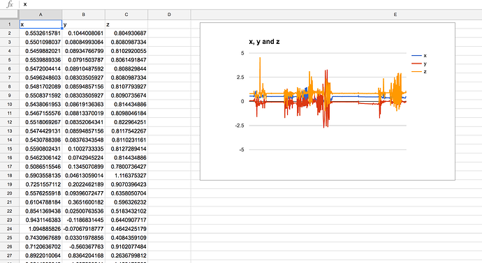
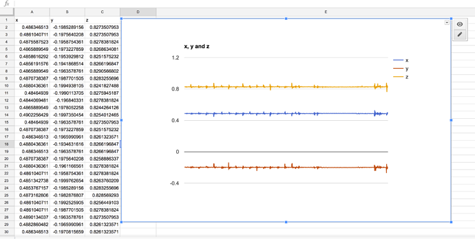
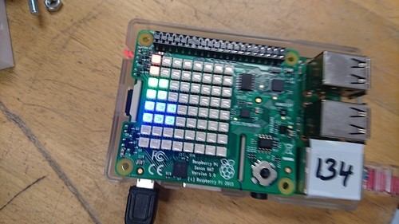

# SLMS Train Sensor

A software toolkit for the Raspberry Pi Sense Hat to enable us to detect when a
train is passing overhead.

Currently doesn't do that and simply displays the accelerometer data on the RGB
matrix display.

Clone the repo then simply run
```shell
$ python sensetrain.py high
```

To enable high sensitivity readings to be displayed.

## Data acquisiton tests

From picking it up and shaking it around:  



From knocking on the table next to it:  



Accelerometer data displayed on the RGB matrix



## Bill of materials (BOM)  

* [Raspberry Pi] ()

* [Raspberry Pi Sense Hat] ()
